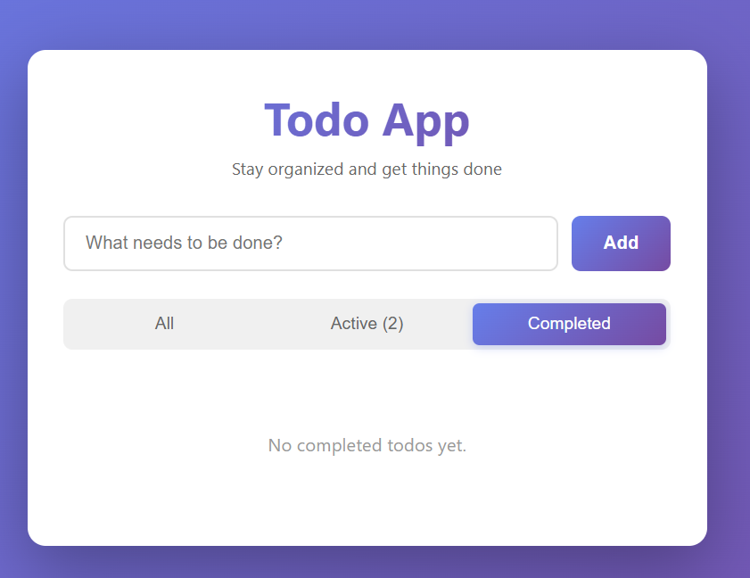

# 📝 Todo App

A beautiful, modern, and fully-featured todo application built with React and Vite. Manage your tasks efficiently with an intuitive interface, persistent storage, and smooth animations.


## ✨ Features

- ✅ **Add Todos** - Quickly add new tasks with a clean input interface
- ✅ **Mark Complete** - Toggle todo completion status with checkboxes
- ✅ **Delete Todos** - Remove tasks you no longer need
- ✅ **Smart Filtering** - Filter todos by All, Active, or Completed status
- ✅ **Active Counter** - See how many tasks are still pending
- ✅ **Persistent Storage** - Todos are automatically saved to localStorage
- ✅ **Responsive Design** - Works seamlessly on desktop, tablet, and mobile devices
- ✅ **Modern UI** - Beautiful gradients, smooth animations, and intuitive UX
- ✅ **Fast Performance** - Built with Vite for lightning-fast development and production builds

## 🚀 Live Demo

🔗 **[View Live App on Vercel](https://todo-lsgg63vbo-prathmeshmutkes-projects.vercel.app/)** ← *Update this after deployment*

## 📸 Screenshots

<div align="center">
  
  
  *Main view of the Todo App showing the beautiful gradient interface, todo items, and filter buttons*
</div>

## 🛠️ Tech Stack

### Frontend Framework
- **React 18.2.0** - Modern UI library for building interactive user interfaces
- **Vite 5.0.8** - Next-generation frontend build tool for fast development

### Styling
- **CSS3** - Custom styles with:
  - Modern gradients and color schemes
  - Smooth transitions and animations
  - Responsive design principles
  - Flexbox for layout

### Development Tools
- **@vitejs/plugin-react** - Vite plugin for React support
- **ES6+ JavaScript** - Modern JavaScript features

### Deployment
- **Vercel** - Serverless deployment platform for frontend applications

## 📋 Project Structure

```
todo-app/
├── public/
├── src/
│   ├── components/
│   │   ├── TodoForm.jsx          # Input form for adding todos
│   │   ├── TodoList.jsx          # Container for todo items
│   │   ├── TodoItem.jsx          # Individual todo component
│   │   ├── FilterButtons.jsx     # Filter controls (All/Active/Completed)
│   │   └── *.css                 # Component-specific styles
│   ├── App.jsx                    # Main application component
│   ├── App.css                    # Main application styles
│   ├── main.jsx                   # Application entry point
│   └── index.css                 # Global styles
├── index.html                     # HTML template
├── package.json                   # Project dependencies and scripts
├── vite.config.js                # Vite configuration
├── vercel.json                    # Vercel deployment configuration
└── README.md                      # Project documentation
```

## 🏃 Getting Started

### Prerequisites

- **Node.js** (v16 or higher)
- **npm** or **yarn** package manager

### Installation

1. **Clone the repository**
   ```bash
   git clone https://github.com/your-username/todo-app.git
   cd todo-app
   ```

2. **Install dependencies**
   ```bash
   npm install
   ```

3. **Start the development server**
   ```bash
   npm run dev
   ```

4. **Open your browser**
   - Navigate to `http://localhost:5173`
   - The app will automatically reload when you make changes

### Build for Production

```bash
npm run build
```

The production build will be created in the `dist` folder, optimized and ready for deployment.

### Preview Production Build

```bash
npm run preview
```

## 🚀 Deployment on Vercel

### Option 1: Deploy via Vercel CLI

1. **Install Vercel CLI**
   ```bash
   npm i -g vercel
   ```

2. **Login to Vercel**
   ```bash
   vercel login
   ```

3. **Deploy**
   ```bash
   vercel
   ```

4. **Follow the prompts** - Vercel will detect your Vite project automatically

### Option 2: Deploy via GitHub Integration

1. **Push your code to GitHub**
   ```bash
   git add .
   git commit -m "Initial commit: Todo App"
   git push origin main
   ```

2. **Go to [Vercel](https://vercel.com)**
   - Sign in with your GitHub account
   - Click "New Project"
   - Import your GitHub repository
   - Vercel will automatically detect Vite configuration
   - Click "Deploy"

3. **Your app will be live!** Vercel will provide you with a URL like `https://your-app-name.vercel.app`

4. **Update README** - Replace the placeholder URL in this README with your actual Vercel URL

## 💡 How to Use

1. **Add a Todo**: Type your task in the input field and click "Add" or press Enter
2. **Complete a Todo**: Click the checkbox next to any todo to mark it as complete
3. **Delete a Todo**: Click the × button to remove a todo permanently
4. **Filter Todos**: Use the filter buttons to view:
   - **All**: See all todos
   - **Active**: See only incomplete todos (shows count)
   - **Completed**: See only finished todos
5. **Auto-Save**: All changes are automatically saved to your browser's localStorage

## 🎨 Features in Detail

### Persistent Storage
Todos are saved in the browser's localStorage, so your tasks persist even after closing the browser. Each todo includes:
- Unique ID
- Text content
- Completion status
- Creation timestamp

### Responsive Design
The app adapts beautifully to different screen sizes:
- **Desktop**: Optimal viewing with maximum width of 600px
- **Tablet**: Responsive layout maintains usability
- **Mobile**: Touch-friendly buttons and optimized spacing

### Modern UI/UX
- Gradient backgrounds and buttons
- Smooth hover effects and transitions
- Intuitive color coding (active/completed states)
- Clean typography and spacing
- Accessible keyboard navigation

## 🔧 Available Scripts

- `npm run dev` - Start development server
- `npm run build` - Build for production
- `npm run preview` - Preview production build locally

## 📝 License

This project is open source and available under the [MIT License](LICENSE).

## 🤝 Contributing

Contributions, issues, and feature requests are welcome! Feel free to check the [issues page](../../issues).

## 👤 Author

**Your Name**
- GitHub: [@your-username](https://github.com/PrathmeshMutke)

## 🙏 Acknowledgments

- Built with [React](https://react.dev/)
- Powered by [Vite](https://vitejs.dev/)
- Deployed on [Vercel](https://vercel.com/)

---

⭐ If you like this project, give it a star on GitHub!